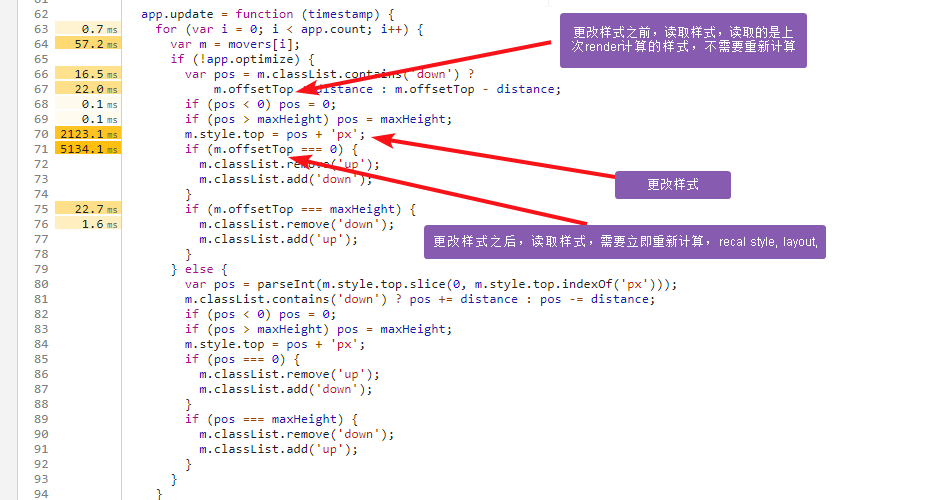
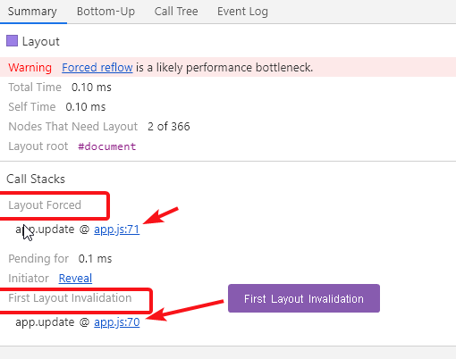

## RAIL
	Responsive: 100 -> 50 ms
	Animation: 16 -> 10ms
	Idle
	Load: 5s
	
## Target
	scrolling should be stick-to-finger fast, and animations and interactions should be silky smooth.
	
## Pixel pipeline
	Javascript(Html parse)
	Style recalculation
	Layout
	Paint (layers) 1) creating a list of draw calls, and 2) filling in the pixels.
	Composite
	
## layout property
	reflow the page 
	
## paint only property  
	repaint
## A property that requires neither layout nor paint, and the browser jumps to just do compositing.

## RequestAnimationFrame instead of setTimeout/setTimeintervl to make visutal changes  
## reduce or move heavy work in main thread. to Web Worker.  Web Workers do not have DOM access.
> taskFinishTime = window.performance.now();
	
***	
# Reduce the Scope and Complexity of Style Calculations	
## Reduce the complexity of your selectors
### Computed style calculation	
    1. The first part of computing styles is to create a set of matching selectors, which is essentially the browser figuring out which classes, pseudo-selectors and IDs apply to any given element.  

    2. The second part of the process involves taking all the style rules from the matching selectors and figuring out what final styles the element has.
## Reduce the number of elements being styled
	
# Reason
[什么时候会强制relayout,google链接](https://developers.google.com/web/tools/chrome-devtools/evaluate-performance/)   

<https://developers.google.com/web/tools/chrome-devtools/evaluate-performance/>

> The problem with this code is that, in each animation frame, 
it changes the style for each square, and then queries the position of each square on the page. 
Because the styles changed, the browser doesn't know if each square's position changed, 
so it has to re-layout the square in order to compute its position. 	
	

	
	
	
	